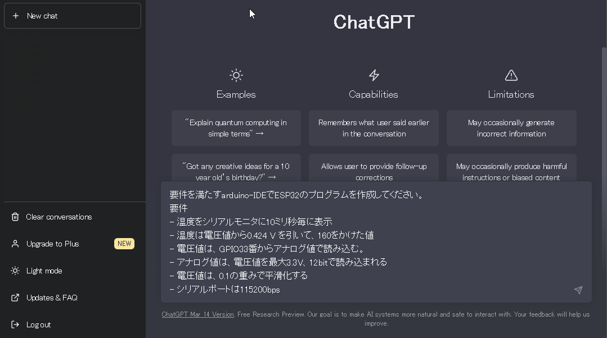

# 19. chatGPTの利用

この章では、これまで使ったコードをchatGPTで生成する方法について説明します。

この文書ファイルをもって追加分のテキストとしますので、別途配布は行いません。この章の動画については県Di室担当者にお問い合わせください。

chatGPTとは、openAIのサイトにある自動チャットサービスです。

( https://chat.openai.com/ )[https://chat.openai.com/]

このチャットサービスは、質問に答えるだけでなく、プログラムを要求するとサンプルコードを出力してくれる機能も有しています。この章では、このコードを出力する機能を使う方法についての説明です。

利用するためにはアカウント作成が必要ですが、メールアドレスとパスワードを登録するだけでアカウントは作成できます。
また、月額数千円の有料版もあり、処理の優先順位が上がり、精度の良い回答が得られるというメリットがあります。
もちろん、無料版でも、ほしい出力を得ることが可能です。ただし、たまに回答中に止まることがありますので、その場合はブラウザを再読込するなどして再開させます。


## 19.1. 指示文章の入力

chatGPTにコードを出力させるには、入力ウインドウに指示文章を記述します。指示文章は「プロンプト」と呼んだりすることもあります。

次の指示文章は、10章のコードに近いものを出力させるものです。

```
要件を満たすarduino-IDEでESP32のプログラムを作成してください。
要件
- 温度をシリアルモニタに10ミリ秒毎に表示
- 温度は電圧値から0.424 V を引いて、160をかけた値
- 電圧値は、GPIO33番からアナログ値で読み込む。
- アナログ値は、電圧値を最大3.3V、12bitで読み込まれる
- 電圧値は、0.1の重みで平滑化する
- シリアルポートは115200bps
```

これをchatGPTの入力ウインドウに入れます。




ただし、入力ウインドウ上で記述していると時間がかかり過ぎて、応答が止まってしまう場合があります。
コツは、コピー＆ペーストの活用です。次の手順で行うと良いようです。

1. 指示文章をテキストエディタなどで作成
2. それをコピー
3. ブラウザでchatGPTのサイトを開き、ログインする
4. 入力ウインドウにペーストし、enterキーを押す


chatGPTの回答は次です。

```
以下が、要件を満たすArduino-IDEでのESP32のプログラム例になります。
このプログラムをコピーして、Arduino-IDEに貼り付け、ESP32にアップロードすることができます。
```

```C++
const int analogPin = 33;  //アナログ読み込みピン番号
const float voltageMax = 3.3;  //最大電圧
const int bit = 12;  //ビット数
const float weight = 0.1;  //平滑化の重み

float voltage, smoothedVoltage, temperature;

void setup() {
  Serial.begin(115200);  //シリアルポートの設定
  pinMode(analogPin, INPUT);  //アナログピンの入力設定
}

void loop() {
  voltage = analogRead(analogPin) * (voltageMax / pow(2, bit));  //アナログ読み込み
  smoothedVoltage = smoothedVoltage * (1 - weight) + voltage * weight;  //平滑化
  temperature = (smoothedVoltage - 0.424) * 160;  //温度計算
  Serial.println(temperature);  //シリアルモニタに表示
  delay(10);  //10ミリ秒待機
}
```

```
このプログラムは、最初にアナログ読み込みピン番号を定義し、最大電圧、ビット数、平滑化の重みを設定しています。
次に、setup関数でシリアルポートを115200bpsで開始し、アナログピンを入力として設定しています。
そして、loop関数でアナログ値を読み込み、平滑化してから温度を計算し、シリアルモニタに表示しています。
最後に、10ミリ秒待機することで、10ミリ秒毎に温度を表示します。
```

このプログラムは、ほぼ10章のコードと同じになっています。


## 19.2. 指示文章における重要な点

ここで、指示文章として重要な点を説明します。

1行目と2行目は定形文と考えましょう。何を出力して欲しいのかを指示します。

```
要件を満たすarduino-IDEでESP32のプログラムを作成してください。
要件
```

今回はプログラムを出力してほしいので、「プログラムを作成してください」が指示になります。

そして、デバイスと言語の指定、そして、要件があることを記述します。
今回は、デバイスとして「ESP32」、言語は「arduino-IDE」で記述するものという指定をしています。

次に要件を記述します。

```
- 温度をシリアルモニタに10ミリ秒毎に表示
- 温度は電圧値から0.424 V を引いて、160をかけた値
- 電圧値は、GPIO33番からアナログ値で読み込む。
- アナログ値は、電圧値を最大3.3V、12bitで読み込まれる
- 電圧値は、0.1の重みで平滑化する
- シリアルポートは115200bps
```

指示文章のコツは、大きい概念とそこに必要な小さい定義を論理的に記述することです。

1. 全体象：最終的に何をするプログラムなのか？
2. 条件：上の全体象で出てきた単語の条件
3. 定義：単語の定義
4. 説明：計算の説明
5. 出力：出力方法の説明


指示文章では「温度」「電圧値」という単語を用いましたが、別でも大丈夫です。例えば、「温度」を「A」に、「電圧値」を「B」に置き換えた文章にしてみましょう。

```
要件を満たすarduino-IDEでESP32のプログラムを作成してください。
要件
- Aをシリアルモニタに10ミリ秒毎に表示
- AはBから0.424を引いて、160をかけた値
- Bは、GPIO33番からアナログ値で読み込む。
- アナログ値は、最大3.3、12bitで読み込まれる
- Bは、0.1の重みで平滑化する
- シリアルポートは115200bps
```

これを読むと少し違和感はありますが、意味は判るはずです。
変更した指示文章でも、論理的な関係性が保たれているためです。
そして、この指示文章をchatGPTに入力しても、ほぼ同じコードが出力されます。
chatGPTは、文章の論理構造を分析して、その内容に沿ったものを出力するサービスです。
つまり、chatGPTへの入力は、論理的に記述することが重要であるといえます。

実は、この指示文章は、ほぼプログラミングと同じであると考えることもできます。
コードでは、「温度」に```temperature```という変数を割り当てていますが、```temperature```を```A```という変数に置き換えても同じ動きをするはずです。
コード上では「温度」という情報は、単なる変数の1つに過ぎません。コンピュータが動作する上では「温度」という名前には何の意味も持たないのです。


ところで、指示文章の順番を変えて次のように記述してみます。
```
- シリアルポートは115200bps
- Bは、GPIO33番からアナログ値で読み込む。
- アナログ値は、最大3.3、12bitで読み込まれる
- Bは、0.1の重みで平滑化する
- AはBから0.424を引いて、160をかけた値
- Aをシリアルモニタに10ミリ秒毎に表示
```

これを1行ずつ、プログラムに変換してみましょう。
```c++
void setup(){Serial.begin(115200);}
void loop(){
 B = analogRead(33)/4096*33;
 Ba = B *0.1 + Ba *0.9;
 A = (Ba - 0.424)*160
 Serial.Println(A);
 delay(10);}
```

この通り、人の手で記述しても、chatGPTが出力した似たコードになります。
このことから、指示文章は、プログラミングに近いものであることを理解できます。

chatGPTは、人工知能(AI, Artificial Intelligence)と呼ばれることが多いですが、人工知能の分野にも様々な分野があり、chatGPTは自然言語処理と呼ばれる分野に属しています。

自然言語とは、人間が扱う言葉の事です。学術的な情報処理分野では、コンピュータ言語と区別するために、人間が扱う言語に「自然」という言葉を付け加えています。

ところで、自然言語とコンピュータ言語の決定的な違いはというと、単語の意味する幅の広さが挙げられます。例えば、曖昧さと表現したり、文脈による行間と表現したりするものです。

人間であれば「読み込む」という単語からは、色々なことが連想できます。
コンピュータを扱う人であれば「読み込む」は「(データを)取得すること」が連想されることでしょう。しかし、コンピュータを知らない人にとって「読み込む」は「しっかり読むこと」とか「熟読すること」を連想する場合もあるかもしれません。

このように、人間が扱う言語は曖昧さがあり、それを場面ごとに適確に判断できるように作るのが、自然言語処理分野における人工知能の開発であるとも言えるでしょう。

ここでは、「読み込む」は「データを取得すること」と解釈し、```analogRead()```が妥当であると判断して出力しているものと想像できます。（しかし、実際のchatGPTの処理は判りません。この例のように単語毎に変換しているのではなく、全体の文意まで分析し、記憶している情報のうち、その文意に近いものを出力しているとも考えられます）

以上のように、chatGPTにコードを出力させるには、具体的な指示が必要であることを理解できることでしょう。


## 19.3. 指示文章のコツ

これまで、chatGPTへの指示文章は具体的な指示を記述するべきと説明しましたが、そんな手間をかけるならば、自分でプログラミングした方が早い訳で、chatGPTに作らせる意味が無くなります。

IoTの目的の1つは、省力化です。これと同じように、chatGPTを使う目的も省力化であるべきでしょう。
ここでは、どのように楽をするのかについて説明します。

まず、これまでの指示文章を再度示します。

```
要件を満たすarduino-IDEでESP32のプログラムを作成してください。
要件
- 温度をシリアルモニタに10ミリ秒毎に表示
- 温度は電圧値から0.424 V を引いて、160をかけた値
- 電圧値は、GPIO33番からアナログ値で読み込む。
- アナログ値は、電圧値を最大3.3V、12bitで読み込まれる
- 電圧値は、0.1の重みで平滑化する
- シリアルポートは115200bps
```

次に、簡略化したものを示します。

```
要件を満たすarduino-IDEでESP32のプログラムを作成してください。
要件
- 温度をシリアルモニタに10ミリ秒毎に表示
- 温度はGPIO33番に接続したテキサスインスツルメンツの温度センサLM60より取得
- 温度は0.1の重みで平滑化する
- シリアルポートは115200bps
```

差分は次になります。
```
- 温度は電圧値から0.424 V を引いて、160をかけた値
- 電圧値は、GPIO33番からアナログ値で読み込む。
- アナログ値は、電圧値を最大3.3V、12bitで読み込まれる
```
この3行が次の1行になっています。
```
- 温度はGPIO33番に接続したテキサスインスツルメンツの温度センサLM60より取得
```

これは、具体的な部品名 LM60 を挙げることで、その周辺情報は判るとしている文章になります。
chatGPTは少し前のwebにある情報を収集していますので、LM60の温度電圧特性やESP32のアナログ入力の仕様がchatGPT内にあるという前提で記述しています。
ここがchatGPTの強さでもあります。

しかし、chatGPTの回答は揺らぐことがありますが、指示文章が漠然としたものになると、その揺らぎの幅も大きくなり、時には大きく外れた回答をする場合もあります。
その点は出力結果をよく見ることが重要と言えます。


## 19.4. 他の指示文書

各章のフォルダに```prompt_xx_xx.txt```というファイル名で入れておきますので、コピーして利用してください。

chatGPTの回答は揺らぐことがありますので、出力結果をよく見て、間違っていると思った場合は、出力をコピーした後に、再度試して見ることをお勧めします。


