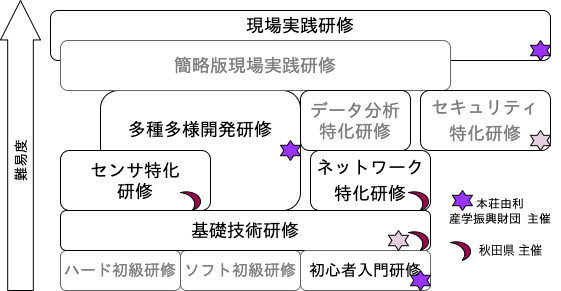

# IoTセンサ特化研修

 2020.10/15-16 , 20-21 

## はじめに
IoTなど先進的な情報通信技術の導入は、人手不足の問題解消や働き方改革に向けた取り組みとして、重要となっています。\\
本研修では、複数のセンサを用い、必要に応じたセンサ選定とそのセンサを用いたセンサノードの製作手法を学びます。

## IoT関連の研修について

## 時間割
| |時間|プログラム|
|---|---|---|
|第一日目|9:30~16:30|開発環境のセッティング 、センサーノードの制作|
|第二日目|9:30~16:30|センサーノードの制作、まとめ|

## 宿題
今回制作したものを参考に、社内などに設置し、下記内容をメールで報告してください。
- 設置したセンサを挙げて下さい
- 取得したデータについて考察してください
- 研修のご感想をお願いします

## セットアップ
本研修では座学でも随時ラズパイ等を操作して確認して頂きます。
まずは準備し起動してください。
Wi-Fiの設定については、正面のホワイトボードをご覧下さい。
- ラズパイ（ラズベリーパイ）のセットアップ（電源はまだ入れない）
- ディスプレイのセットアップ
- ラズパイの電源投入
- Wi-Fi接続
- ブラウザを立ち上げテキストを表示してください

